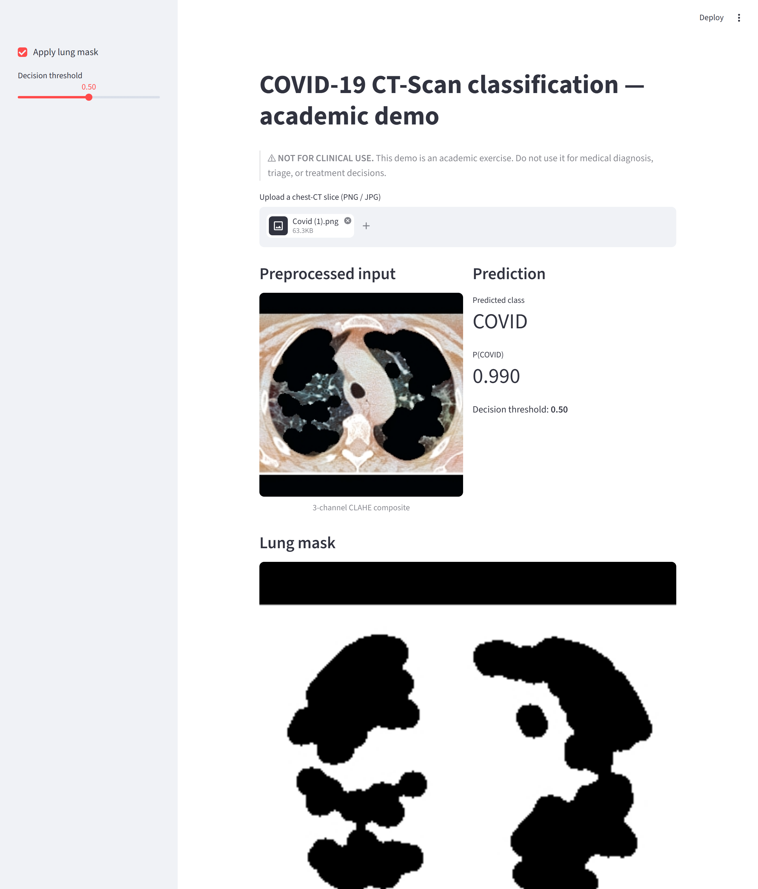
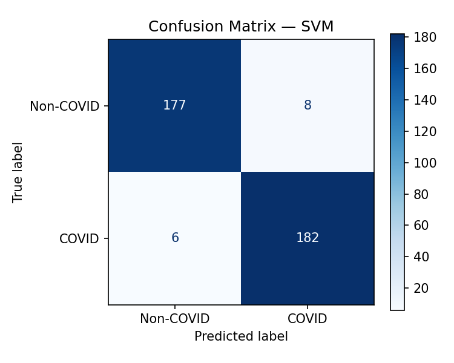

# Classificazione COVID-19 da TAC del torace

> **AVVISO MEDICO**
> Questo progetto ha esclusivamente **finalita' accademiche e di ricerca**.
> **NON e' validato per uso clinico** e **NON deve** essere impiegato per
> diagnosi mediche, triage o decisioni terapeutiche.

[](https://github.com/zucca98/CV-3724-COVID/actions/workflows/ci.yml)


Classificazione binaria di slice TAC del torace: COVID-19 vs Non-COVID.
Progetto accademico per il corso di Computer Vision EPICODE.

**Miglior risultato:** SVM (HOG + LBP + GLCM, PCA-200) -> AUC-ROC **0.9963**
sul test set held-out. Il modello deep EfficientNet-B0 fine-tunato raggiunge
AUC-ROC 0.981 - la baseline SVM classica resta la piu' forte su questo dataset.

---

## Demo



*Demo Streamlit con una slice COVID di esempio: l'SVM predice `COVID` con
`p = 0.990`. Avvio locale: `streamlit run app/demo.py`.*



*Matrice di confusione della baseline SVM su 373 immagini di test
(eseguire `scripts/run_full_evaluation.py` per rigenerarla).*

---

## Installazione

Sono supportati due percorsi di installazione: un **virtualenv Python locale**
oppure un'**immagine Docker** (consigliata per la riproducibilita' completa -
fissa le stesse librerie di sistema, Python 3.12 e i wheel PyTorch CPU-only
usati per i risultati riportati).

### Opzione A - Virtual environment locale

```bash
# 1. Clonazione
git clone https://github.com/zucca98/CV-3724-COVID.git
cd CV-3724-COVID

# 2. Ambiente virtuale e installazione (Python 3.12 consigliato)
python -m venv .venv
. .venv/Scripts/activate           # Linux/macOS: source .venv/bin/activate
pip install --index-url https://download.pytorch.org/whl/cpu torch torchvision
pip install -e ".[dev]"            # installazione editable (PYTHONPATH=. non serve)
```

### Opzione B - Docker (consigliata per la riproducibilita')

Il repository include un [`Dockerfile`](Dockerfile) CPU-only (Python 3.12-slim,
librerie di sistema per OpenCV/lungmask, progetto installato in modalita'
editable). Non serve alcuna toolchain Python locale - solo Docker.

```bash
# 1. Clonazione
git clone https://github.com/zucca98/CV-3724-COVID.git
cd CV-3724-COVID

# 2. Build dell'immagine (~5 min la prima volta, poi i layer sono in cache)
docker build -t covid-ct .

# 3. Verifica dell'installazione eseguendo i test all'interno del container
docker run --rm -v ${PWD}:/app -w /app covid-ct pytest tests/ -v

# 4. Esecuzione di uno script della pipeline (montaggio della cwd per persistere gli output)
docker run --rm -v ${PWD}:/app -w /app covid-ct \
    python scripts/prepare_data.py

# 5. Avvio della demo Streamlit su http://localhost:8501
docker run --rm -p 8501:8501 -v ${PWD}:/app -w /app covid-ct \
    streamlit run app/demo.py --server.address 0.0.0.0
```

> Il container e' **CPU-only per scelta progettuale** (riproducibilita' della
> pipeline classica). Il training del modello deep (`train_deep.py`) richiede
> una GPU CUDA - eseguirlo direttamente con l'Opzione A su una macchina con
> GPU NVIDIA (lo script rileva CUDA in automatico) oppure usare Google Colab /
> Kaggle come fallback (vedi
> [`notebooks/03_train_colab.ipynb`](notebooks/03_train_colab.ipynb)).

### Esecuzione della pipeline

Dopo l'installazione (Opzione A o B), scaricare il dataset ed eseguire la
pipeline classica:

```bash
# 1. Download del dataset (richiede Kaggle CLI - vedi sezione Dataset)
kaggle datasets download -d plameneduardo/sarscov2-ctscan-dataset
unzip sarscov2-ctscan-dataset.zip

# 2. Pipeline (CPU, ~10 min totali per il ramo classico)
python scripts/prepare_data.py
python scripts/compute_norm_stats.py        # statistiche di normalizzazione sul train
python scripts/extract_features.py
python scripts/train_classical.py
python scripts/run_full_evaluation.py

# 3. Training deep - richiede GPU CUDA (GPU NVIDIA locale o Colab; vedi notebooks/03_train_colab.ipynb)
python scripts/train_deep.py
```

Usando Docker, anteporre a ogni comando `python ...` il prefisso
`docker run --rm -v ${PWD}:/app -w /app covid-ct` (oppure aprire una shell
interattiva con `docker run --rm -it -v ${PWD}:/app -w /app covid-ct bash`).

---

## Dataset

**SARS-CoV-2 CT-Scan** (Soares et al., 2020) - 2 481 immagini PNG, due classi:
`COVID/` e `non-COVID/`. Licenza: CC BY 4.0.

Download da Kaggle:

```bash
kaggle datasets download -d plameneduardo/sarscov2-ctscan-dataset
unzip sarscov2-ctscan-dataset.zip
```

> **Nota sul data leakage:** il dataset non contiene identificatori paziente.
> Slice dello stesso paziente possono finire in split diversi, gonfiando le
> metriche di generalizzazione. Limite dichiarato esplicitamente in
> `docs/analisi_tecnica.md`.

---

## Struttura del repository

```text
CV-3724-COVID/
├── configs/
│   └── default.yaml             # Tutti gli iperparametri
├── data/processed/              # CSV train/val/test + feature NPZ generati
├── docs/
│   ├── figures/                 # Grafici di valutazione auto-generati
│   ├── technical_analysis.md    # Report tecnico (sorgente EN)
│   ├── technical_analysis.pdf   # PDF compilato (<= 10 pagine)
│   ├── MODEL_CARD.md            # Model card (EN)
│   ├── DATASHEET.md             # Datasheet dataset (EN)
│   └── it/                      # Versione italiana
│       ├── analisi_tecnica.md   # Report tecnico (IT)
│       ├── MODEL_CARD.md        # Model card (IT)
│       └── DATASHEET.md         # Datasheet dataset (IT)
├── logs/                        # File JSON dei risultati
├── models/
│   ├── classical/               # Pickle SVM e RF addestrati
│   └── deep/                    # Checkpoint EfficientNet
├── notebooks/
│   ├── 01_eda.ipynb             # Analisi esplorativa
│   ├── 02_preprocessing_demo.ipynb
│   ├── 03_train_colab.ipynb     # Training GPU (fallback Colab; supportata anche GPU locale via train_deep.py)
│   └── 04_results.ipynb         # Tabella comparativa finale
├── scripts/
│   ├── prepare_data.py                   # Split stratificato -> CSV
│   ├── compute_norm_stats.py             # Media/std per canale del train
│   ├── extract_features.py               # HOG + LBP + GLCM -> NPZ
│   ├── train_classical.py                # SVM / RF con GridSearchCV
│   ├── train_deep.py                     # Fine-tuning a due fasi EfficientNet
│   ├── calibrate_and_evaluate.py         # Temperature scaling + tuning soglia
│   ├── generate_qualitative_examples.py  # Figura TP/TN/FP/FN
│   └── run_full_evaluation.py            # Tutte le figure + tabella comparativa
├── app/
│   └── demo.py                  # Demo Streamlit upload-and-predict
├── Dockerfile                   # Ambiente riproducibile CPU (pipeline classica + demo; deep training usa GPU host)
├── .github/workflows/ci.yml     # GitHub Actions CI (pytest)
├── src/
│   ├── preprocessing.py         # CLAHE, lung mask, augmentation
│   ├── features.py              # Estrazione feature handcrafted
│   ├── models/
│   │   ├── classical.py         # SVM, RandomForest
│   │   └── deep.py              # EfficientNet-B0 + training loop
│   ├── postprocess.py           # Temperature scaling, TTA, Grad-CAM
│   └── evaluate.py              # Metriche, plot ROC/PR/calibrazione
└── tests/                       # Smoke test (pytest)
```

---

## Riproduzione dei risultati

### Baseline classiche (CPU, ~10 min totali)

```bash
python scripts/prepare_data.py
python scripts/compute_norm_stats.py
python scripts/extract_features.py
python scripts/train_classical.py
python scripts/run_full_evaluation.py
python scripts/generate_qualitative_examples.py    # figura TP/TN/FP/FN
```

Risultati scritti in `logs/classical_results.json` e `docs/figures/`.

### Modello deep (GPU CUDA richiesta)

Due opzioni:

- **GPU NVIDIA locale.** Con un'installazione PyTorch CUDA (Opzione A), eseguire
  `python scripts/train_deep.py --arch efficientnet_b0 --batch-size 32
  --output-dir models/deep`. Lo script rileva la GPU automaticamente tramite
  `torch.cuda.is_available()`.
- **Fallback Google Colab.** Aprire `notebooks/03_train_colab.ipynb` in Colab
  (Runtime -> T4 GPU). I pesi vengono salvati su Google Drive e persistono al
  termine della sessione.

### Pesi pre-addestrati

Il checkpoint addestrato `best_model.pth` (~16 MB) **non** e' committato in git
(`*.pth` e' in `.gitignore`). Per valutare il modello deep o eseguire il
post-processing senza riaddestrare (~4 h), scaricarlo dalla GitHub Release:

```bash
mkdir -p models/deep

# Con la GitHub CLI:
gh release download v0.1.0 --repo zucca98/CV-3724-COVID \
    --pattern best_model.pth --dir models/deep

# Oppure con curl:
curl -L -o models/deep/best_model.pth \
  https://github.com/zucca98/CV-3724-COVID/releases/download/v0.1.0/best_model.pth
```

### Post-processing (CPU, richiede checkpoint deep gia' addestrato)

```bash
python scripts/calibrate_and_evaluate.py \
    --model-dir models/deep \
    --output-dir models/postprocess
```

### Esecuzione test

```bash
pytest tests/ -v
```

### Demo Streamlit (uso accademico; non clinico)

```bash
pip install streamlit
streamlit run app/demo.py
```

---

## Google Colab

[](https://colab.research.google.com/github/zucca98/CV-3724-COVID/blob/main/notebooks/03_train_colab.ipynb)

---

## Citazione

Se si utilizza il dataset, citare:

```bibtex
@article{soares2020sars,
  title   = {{SARS-CoV-2 CT-scan dataset}: A large dataset of real patients
             CT scans for {SARS-CoV-2} identification},
  author  = {Soares, Eduardo and Angelov, Plamen and Biaso, Sarah and
             Froes, Michele Higa and Abe, Daniel Kanda},
  journal = {medRxiv},
  year    = {2020},
  doi     = {10.1101/2020.04.24.20078584}
}
```

---

## Licenza

MIT - vedere `LICENSE`. Dataset: CC BY 4.0 (Soares et al., 2020).
