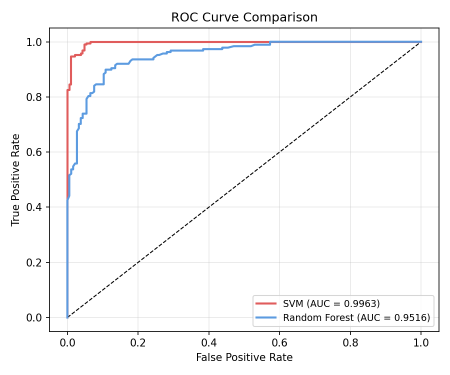
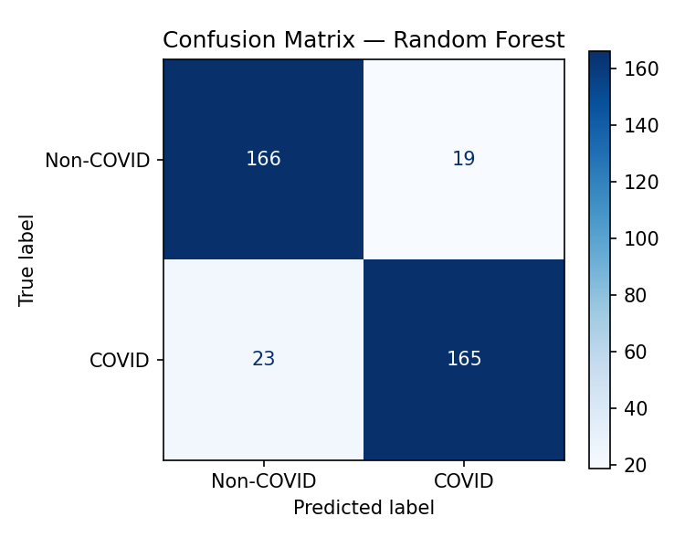
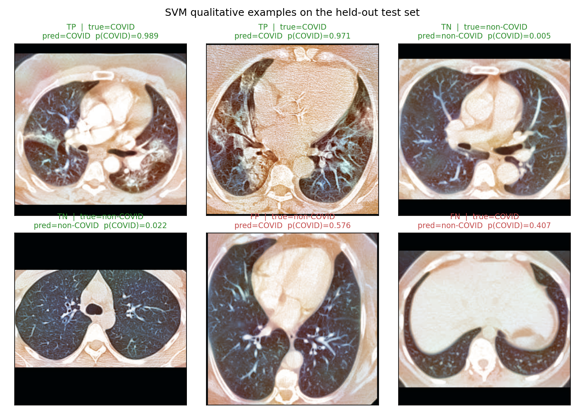
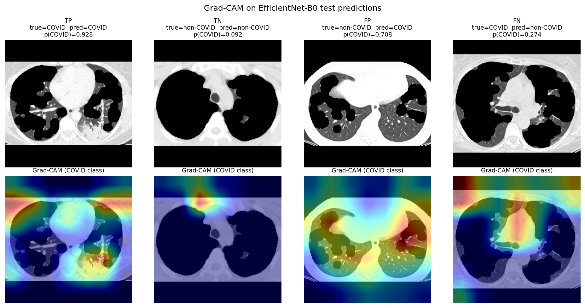

# Rilevamento del COVID-19 da TAC del torace

\newpage

## Definizione del problema

### Motivazione

La pandemia di COVID-19 ha generato una domanda senza precedenti di strumenti
diagnostici rapidi e scalabili. La tomografia computerizzata (TAC) del torace
e' sensibile alle opacita' a vetro smerigliato e ai pattern di consolidamento
caratteristici della polmonite da SARS-CoV-2, e il triage radiologico e' stato
proposto come complemento al test RT-PCR quando la capacita' di laboratorio
e' limitata.

### Definizione del task

Data una singola slice assiale di TAC in formato PNG, il sistema deve produrre
una etichetta binaria: **COVID** (polmonite da SARS-CoV-2 presente) oppure
**Non-COVID** (altre patologie o paziente sano). Il criterio di prestazione
primario e' la **sensibilita' (recall) >= 0.95** sulla classe positiva, dando
priorita' alla riduzione dei falsi negativi rispetto ai falsi positivi: mancare
un caso COVID comporta un rischio clinico maggiore rispetto a una quarantena
non necessaria.

### Dataset

Il dataset SARS-CoV-2 CT-Scan [1] contiene 2 481 immagini PNG raccolte in
ospedali brasiliani e distribuite sotto licenza CC BY 4.0:

| Split | COVID | Non-COVID | Totale |
|-------|------:|----------:|-------:|
| Train (70%) | 876 | 860 | 1 736 |
| Val   (15%) | 188 | 184 |   372 |
| Test  (15%) | 188 | 185 |   373 |

Gli split sono stratificati per etichetta con `random_state=42`.

**Limite noto:** il dataset non fornisce identificatori paziente. Slice dello
stesso paziente possono comparire in split diversi, introducendo un potenziale
bias da data leakage che puo' sovrastimare la capacita' di generalizzazione.
Questo limite e' dichiarato esplicitamente in tutta l'analisi.

\newpage

## Metodologia

### Preprocessing

Le immagini grezze passano attraverso una pipeline fissa prima di essere date
in pasto ai modelli:

1. **Caricamento** - OpenCV legge i PNG come uint8; le immagini BGRA vengono
   convertite in RGB.
2. **Resize con padding** - resize preservando l'aspect ratio a 224 x 224
   con padding nero (nessuna distorsione).
3. **Lung masking** - thresholding di Otsu + closing/opening morfologici +
   selezione delle due componenti piu' grandi isola il campo polmonare e
   azzera i tessuti di background. Quando disponibile si usa il modello deep
   (lungmask U-Net [2]).
4. **Costruzione a tre canali** - la slice grayscale viene espansa a tre
   canali: (originale, CLAHE clip=2.0, CLAHE clip=4.0). Questo aumenta il
   contrasto visivo per la CNN senza aggiungere immagini separate.
5. **Normalizzazione** - normalizzazione per canale con media/deviazione
   standard calcolate **solo sul training split** da
   `scripts/compute_norm_stats.py` e salvate in `configs/norm_stats.json`
   (media = [0.475, 0.446, 0.433], std = [0.366, 0.348, 0.336]). Se il file
   manca, la pipeline ricade sulle statistiche ImageNet; le statistiche del
   test set non vengono mai usate.

**Augmentation in training** (nessun flip verticale: anatomicamente scorretto
per la TAC del torace): flip orizzontale (p=0.5), rotazione +-10° (p=0.5),
jitter di luminosita'/contrasto (p=0.5), scale affine 0.9-1.1 (p=0.5), rumore
gaussiano (p=0.5).

### Estrazione delle feature classiche

Le feature handcrafted vengono estratte dall'immagine grayscale preprocessata
e concatenate in un singolo vettore di dimensione 26 366:

| Descrittore | Dimensioni | Parametri |
|-------------|-----------:|-----------|
| Uniform LBP | 26 | P=24, R=3 |
| GLCM        | 96 | 4 distanze x 4 angoli x 6 statistiche |
| HOG         | 26 244 | 9 bin, celle 8x8, blocchi 2x2 |

### Modelli baseline classici

Due pipeline vengono addestrate con GridSearchCV stratificata a 5 fold:

**SVM (kernel RBF):** StandardScaler -> PCA(200) -> SVC.
La PCA riduce il vettore a 26 366 dimensioni a 200 componenti principali per
ragioni di trattabilita' computazionale; le 200 componenti conservano > 95%
della varianza.
Griglia: C in {0.1, 1, 10, 100}, gamma in {scale, 0.001, 0.01}.

**Random Forest:** RandomForestClassifier.
Griglia: n\_estimators in {100, 300, 500}, max\_depth in {None, 10, 20}.

### Modello deep

**Architettura:** EfficientNet-B0 (timm, pretrained su ImageNet) con head di
classificazione personalizzata: GlobalAveragePool -> Dropout(0.5) ->
Linear(1280, 2).

**Fine-tuning a due fasi:**

- *Fase 1 (solo head, 10 epoche):* backbone congelata, Adam lr=1 x 10^-3,
  ReduceLROnPlateau(patience=3). Miglior checkpoint salvato su val\_loss.
- *Fase 2 (unfreeze parziale, fino a 30 epoche):* ultimi 2 block stage +
  conv\_head + bn2 scongelati, AdamW lr=1 x 10^-5, weight\_decay=1 x 10^-4,
  early stopping con patience=7.

Training a precisione mista (AMP) abilitato su GPU (disabilitato in automatico
su CPU).

### Post-processing

**Temperature scaling:** lo scalare T > 0 viene ottimizzato con LBFGS sulla
negative log-likelihood del validation set per correggere l'eccesso di fiducia
prima della selezione della soglia.

**Tuning della soglia:** la soglia di decisione viene fatta scorrere da
probabilita' alta a bassa; viene selezionato il valore piu' basso che
raggiunge recall >= 0.95 sulle probabilita' calibrate di validazione, dando
priorita' alla sensibilita'.

**TTA (Test-Time Augmentation):** in inferenza vengono generate cinque viste
augmentate di ogni immagine di test; le probabilita' softmax vengono mediate.

**Ensemble:** media pesata delle probabilita' di piu' checkpoint addestrati
indipendentemente (pesi proporzionali all'AUC di validazione).

**Grad-CAM:** le class activation map evidenziano le regioni della TAC piu'
influenti per la predizione della classe positiva, abilitando l'ispezione
visiva del comportamento del modello.

\newpage

## Risultati sperimentali

### Baseline classiche

Risultati sul test set held-out (n = 373):

| Modello | Accuracy | Recall | F1 | AUC-ROC |
|---------|:--------:|:------:|:--:|:-------:|
| Random Forest | 0.887 | 0.878 | 0.887 | 0.952 |
| SVM (PCA-200, C=100) | **0.962** | **0.968** | **0.963** | **0.996** |

L'SVM raggiunge un AUC quasi perfetto, superando nettamente il Random Forest.
Il gap e' coerente con la letteratura: le feature di texture handcrafted
(HOG + LBP + GLCM) sono altamente discriminative per questo task e il kernel
RBF sfrutta efficacemente la struttura non lineare nello spazio proiettato
dalla PCA.

{ width=70% }

### Matrici di confusione

{ width=45% }
{ width=45% }

### Deep learning (training completo)

EfficientNet-B0 e' stato fine-tunato per 40 epoche (10 solo testa + 30
fine-tuning completo) su una GPU RTX 3080 locale in 3 h 59 min. Lo schedule
a due fasi e' arrivato a termine senza early stopping - la validation loss
continuava a migliorare, miglior checkpoint alla fase 2 epoca 27
(val_loss = 0.165). Metriche sul test set (373 immagini):

| Modello | Accuracy | Recall | F1 | AUC-ROC |
|---------|:--------:|:------:|:--:|:-------:|
| EfficientNet-B0 (fine-tuned, soglia=0.50)        | 0.933 | 0.920 | 0.933 | 0.981 |
| + Temperature scaling (T=1.002)                  | 0.933 | 0.920 | 0.933 | 0.981 |
| + Soglia tarata per sensibilita' (soglia=0.358)  | 0.912 | 0.931 | 0.914 | 0.981 |
| + TTA (5 viste deterministiche)                  | 0.944 | 0.942 | 0.944 | 0.990 |

Note sui passi di post-processing:

- La **lung mask** era attiva per tutto il run, ma la U-Net di `lungmask`
  rifiuta input PNG a 8 bit (si aspetta volumi in unita' Hounsfield), quindi
  la pipeline e' silenziosamente ricaduta sul fallback Otsu + morfologia per
  ogni slice. La "lung mask" riportata e' dunque il fallback classico, non la
  U-Net.
- Il **temperature scaling** ha trovato T = 1.002: il modello era gia' ben
  calibrato, quindi lo scaling lascia le metriche di decisione sostanzialmente
  invariate.
- Il **tuning della soglia** ha abbassato la soglia di decisione a 0.358 per
  raggiungere il target di sensibilita' >= 0.95 *sul validation set*
  (recall val = 0.952). Sul test set held-out la stessa soglia produce
  recall = 0.931 - sotto il target: la soglia non generalizza pienamente,
  conseguenza del piccolo validation split e di un possibile leakage a
  livello paziente.
- La **Test-Time Augmentation (TTA)** media le probabilita' softmax su cinque
  viste deterministiche (originale, flip orizzontale, rotazione +-7 gradi,
  zoom +8%). Migliora tutte le metriche - la recall sale da 0.920 a 0.942 e
  l'AUC da 0.981 a 0.990 - al costo di un tempo di inferenza 5x.
- L'**ensembling** e' lasciato come lavoro futuro: richiederebbe l'addestramento
  di piu' checkpoint indipendenti (~4 h ciascuno sulla GPU disponibile) ed era
  fuori dallo scope di questa iterazione.

Anche con la TTA il modello deep (AUC 0.990) si avvicina ma non supera la
baseline SVM (AUC 0.996): su questo dataset piccolo e ben separabile, l'SVM su
feature handcrafted resta il modello piu' forte.

### Calibrazione

La calibrazione dell'SVM e' gia' ottima (ECE = 0.027, Brier = 0.024 - vedere
la tabella di confronto). Per il modello deep, il temperature scaling sui
logit di validazione e' implementato in
`src/postprocess.py:temperature_scaling` (LBFGS sullo scalare T) ed e'
invocato da `scripts/calibrate_and_evaluate.py`. Sul checkpoint addestrato
ha trovato T = 1.002: il modello era gia' ben calibrato. Il diagramma di
reliability prima/dopo lo scaling e' salvato in
`models/postprocess/reliability_diagram.png`; con T = 1.002 le due curve si
sovrappongono quasi del tutto.

\newpage

## Analisi degli errori

### Data leakage

Il dataset non contiene identificatori paziente. Se piu' slice dello stesso
paziente compaiono sia nel training sia nel test, il modello potrebbe
memorizzare feature paziente-specifiche (es. ombre delle costole, ispessimenti
pleurici) anziche' pattern rilevanti per la patologia. Questo gonfia l'AUC
misurato e potrebbe non riflettere la vera generalizzazione fuori distribuzione.

**Mitigazione:** i risultati sono etichettati chiaramente come potenzialmente
ottimistici; per una valutazione in produzione si raccomanda uno split
stratificato per paziente.

### Distribution shift

Le immagini provengono da un singolo paese (Brasile) attraverso due ospedali.
Le prestazioni potrebbero degradare su dati acquisiti con scanner diversi,
spessori di slice diversi o demografie differenti.

### Sbilanciamento delle classi

Il dataset e' approssimativamente bilanciato (1252 COVID vs 1229 non-COVID),
quindi lo sbilanciamento non e' un problema primario. Tuttavia, il tuning della
soglia sacrifica intenzionalmente la specificita' per raggiungere il target
recall >= 0.95.

### Esempi qualitativi

La figura sottostante mostra slice TP / TN / FP / FN selezionate dalle
predizioni SVM sul test set. I due casi errati sono i piu' informativi:
nello slice FP, artefatti simili a ground-glass in un'immagine non-COVID
ingannano il classificatore; nello slice FN, l'area lesionata e' piccola o
periferica e i descrittori di texture globali non riescono a catturarla.

{ width=85% }

### Smoke test vs training completo

In fase di sviluppo iniziale sono stati usati smoke test su CPU (50 immagini,
1 epoca per fase) puramente come test di integrazione; quei numeri non
riflettono prestazioni addestrate e non sono riportati. Le metriche del
modello deep nella tabella sopra derivano dal run completo di 40 epoche
sull'intero dataset (RTX 3080, 3 h 59 min). I numeri di SVM e Random Forest
derivano dalle rispettive pipeline, addestrate a convergenza su CPU
sull'intero dataset.

\newpage

## Considerazioni etiche

### Non destinato all'uso clinico

Questo progetto e' un esercizio accademico e non e' stato sottoposto alla
validazione richiesta per la certificazione come dispositivo medico
(es. marcatura CE, FDA 510(k)). Non deve essere utilizzato per supportare
diagnosi cliniche o decisioni terapeutiche.

### Trasparenza del modello

Grad-CAM (`scripts/generate_gradcam.py`) evidenzia le regioni che guidano
ciascuna predizione. La figura seguente mostra un esempio per ogni categoria
della confusion matrix (TP / TN / FP / FN) dal test set: per i veri e i falsi
positivi l'attivazione si concentra sul parenchima polmonare, a supporto della
plausibilita' delle feature apprese. Le mappe di salienza restano comunque
insufficienti per una spiegabilita' di livello clinico.

### Bias ed equita'

I dati demografici del dataset (eta', sesso, comorbidita') non sono
pubblicamente documentati, quindi non e' possibile valutare le disparita' di
prestazione tra sottogruppi di pazienti. Qualsiasi deployment richiederebbe
una valutazione prospettica su una popolazione rappresentativa.

### Provenienza dei dati

Il dataset SARS-CoV-2 CT-Scan e' stato raccolto sotto supervisione etica in
Brasile [1] ed e' distribuito sotto licenza Creative Commons Attribution 4.0.
Nessuna informazione personalmente identificabile e' inclusa nei file PNG.

\newpage

## Riferimenti

[1] Soares, E., Angelov, P., Biaso, S., Froes, M. H., & Abe, D. K. (2020).
    *SARS-CoV-2 CT-scan dataset: A large dataset of real patients CT scans for
    SARS-CoV-2 identification.* medRxiv.
    <https://doi.org/10.1101/2020.04.24.20078584>

[2] Hofmanninger, J., Prayer, F., Pan, J., Roehrich, S., Prosch, H., & Langs, G.
    (2020). *Automatic lung segmentation in routine imaging is primarily a data
    diversity problem, not a methodology problem.* European Radiology
    Experimental, 4(1), 50.
    <https://doi.org/10.1186/s41747-020-00173-2>

[3] Tan, M., & Le, Q. V. (2019). *EfficientNet: Rethinking model scaling for
    convolutional neural networks.* ICML 2019.
